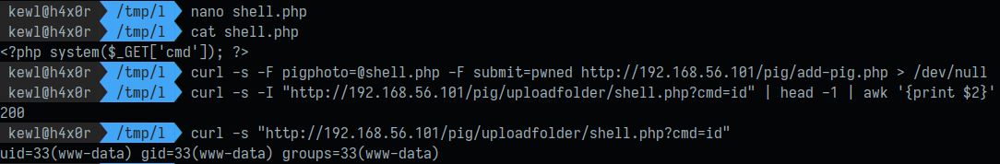

# CVE-2023-37629

```
Product : Online Piggery Management System - 1.0
Vulnerability Type : Unauthenticated File Upload
Vendor of Product : Create Network NG

Desc : An unauthenticated user can upload a php file by sending a POST request to "add-pig.php".
```

## Vulnerable Code

```php
// file : add-pig.php
...
$res1_name = basename($_FILES['pigphoto']['name']);
$tmp_name = $_FILES['pigphoto']['tmp_name'];
$type = $_FILES['pigphoto']['type'];
$max_size = 2097152;
$size = $_FILES['pigphoto']['size'];

if (isset($res1_name)) {
	$location = 'uploadfolder/';
	$move = move_uploaded_file($tmp_name, $locati$res1_name);
	$path1 = $location.$res1_nam

	if (!$move) {
		$fileerror = $_FILES['pigphoto']['error'];
		$message = $upload_errors[$fileerror];
...
```

# POC

